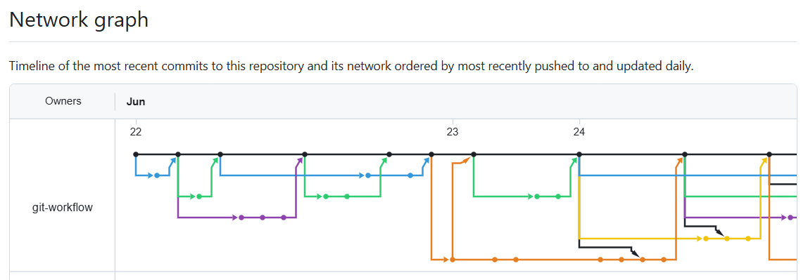
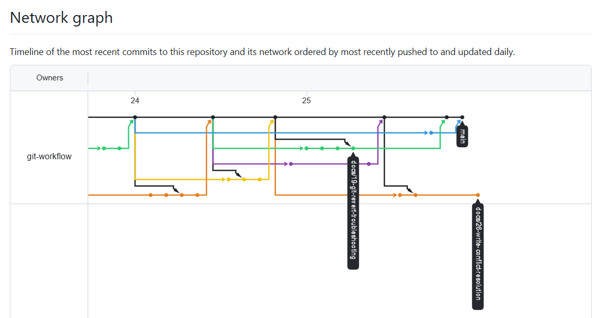

# Submission Index

## 변경 및 추가 사유
- 과제 최종 제출 및 평가를 위해 저장소의 모든 협업 활동(팀 정보, 멤버별 PR 링크, 핵심 문서 경로, 증징 데이터)을 정리한 인덱스 문서 구축 필요.
- 평가자가 프로젝트의 전체 흐름(GitHub Flow 운영 및 비자명 충돌 해결 이력)을 한눈에 확인하고 신속하게 검증할 수 있도록 지원하기 위함.

---

## Team
- **저장소:** https://github.com/git-workflow/b2-2.git

---

## Member PRs
- **김한규**
  - Issue: https://github.com/git-workflow/b2-2/issues/1
    - PR: https://github.com/git-workflow/b2-2/pull/2 (chore: create issue template)
  - Issue: https://github.com/git-workflow/b2-2/issues/3
    - PR: https://github.com/git-workflow/b2-2/pull/5 (chore: create pr template)
  - Issue: https://github.com/git-workflow/b2-2/issues/6
    - PR: https://github.com/git-workflow/b2-2/pull/9 (docs: 과제 수행을 위한 사전 지식 학습 노트
    )
  - Issue: https://github.com/git-workflow/b2-2/issues/18
    - PR: https://github.com/git-workflow/b2-2/pull/22 (docs: git reset에 대한 트러블슈팅 시나리오 추가)
  - Issue: https://github.com/git-workflow/b2-2/issues/19
  - Issue: https://github.com/git-workflow/b2-2/issues/15
    - PR: https://github.com/git-workflow/b2-2/pull/25 (docs: git revert에 대한 트러블슈팅 시나리오 추가)
  - Issue: https://github.com/git-workflow/b2-2/issues/17
  - Issue: https://github.com/git-workflow/b2-2/issues/26
    - PR: https://github.com/git-workflow/b2-2/pull/30 (docs: conflict-resolution.md 충돌 기록2 작성)
  - Issue: https://github.com/git-workflow/b2-2/issues/32
    - PR: https://github.com/git-workflow/b2-2/pull/33 (docs: README.md 작성)

- **권창범**
  - Issue: https://github.com/git-workflow/b2-2/issues/7
    - PR: https://github.com/git-workflow/b2-2/pull/10 (docs: add contributing guide)
  - Issue: https://github.com/git-workflow/b2-2/issues/11
    - PR: https://github.com/git-workflow/b2-2/pull/12 (docs: add git workflow notes)
  - Issue: https://github.com/git-workflow/b2-2/issues/13
    - PR: https://github.com/git-workflow/b2-2/pull/16 (docs: add amend troubleshooting scenario)
  - Issue: https://github.com/git-workflow/b2-2/issues/21
    - PR: https://github.com/git-workflow/b2-2/pull/28 (docs: add codeowners configuration)
  - Issue: https://github.com/git-workflow/b2-2/issues/29
    - PR: https://github.com/git-workflow/b2-2/pull/31 (docs: add rebase history task)

- **서예영**
  - Issue: https://github.com/git-workflow/b2-2/issues/4 
    - PR: https://github.com/git-workflow/b2-2/pull/8 (docs: b2-2 과제 용어 정리 학습 노트 문서 생성)
  - Issue: https://github.com/git-workflow/b2-2/issues/14
    - PR: https://github.com/git-workflow/b2-2/pull/20 (docs: stash troubleshooting 문서정리)
  - Issue: https://github.com/git-workflow/b2-2/issues/23
    - PR: https://github.com/git-workflow/b2-2/pull/24 (docs: conflict-resolution.md 충돌 기록1 작성)
  - Issue: https://github.com/git-workflow/b2-2/issues/27
    - PR: https://github.com/git-workflow/b2-2/pull/34 (docs: SUBMISSION.md 작성)


---

## Key Docs
- **Contributing:** `docs/CONTRIBUTING.md` (팀 브랜치 네이밍 컨벤션, 이슈-PR 연동 규칙, LGTM 금지 등의 코드 리뷰 품질 기준 수립)
- **Conflict log:** `docs/conflict-resolution.md` (비자명 충돌 상황 및 해결 보고서)
- **Troubleshooting:** `docs/troubleshooting-log.md` (amend, reset, revert, stash 팀 전체 4종 시나리오 재현 절차, 해결 결과 및 실무 주의점 기록 완료)
- **CODEOWNERS:** `docs/codeowners.md` (PR 생성 시 기본 책임 리뷰어 지정 설정 및 문서화)
- **Rebase History:** `docs/rebase-history.md` (git rebase -i를 활용한 커밋 히스토리 정리 실습 기록)

---

## Evidence

### Git Graph
```
* affffc4 docs: update submission index with detailed member PRs and add evidence images
* 4117df9 docs: create submission index document with team and member PRs
| * a1de3f4 docs: resolve conflict markers in conflict resolution log
| * 297f27c docs: add conflict resolution log for git stash and amend scenarios
|/  
| * 6de8f07 docs: add scenario for git reset troubleshooting with detailed explanation
| *   4a54377 Merge branch 'main' of https://github.com/git-workflow/b2-2 into docs/18-git-reset-troubleshooting
| |\  
| |/  
|/|   
* |   c5d5edb Merge pull request #20 from git-workflow/docs/14-stash-troubleshooting
|\ \  
| * | 413e0c2 docs: enhance troubleshooting log for git stash operations with detailed steps and images
| * |   281c8b0 Merge branch 'main' of https://github.com/git-workflow/b2-2 into docs/14-stash-troubleshooting
| |\ \  
| |/ /  
|/| |   
| * | 0ea63af docs: refine troubleshooting log for git stash operations
| * | cb7581c docs: add troubleshooting images for stash operations
| * | aa64f62 docs: add troubleshooting log for git stash operations
| * | 314544e docs: add troubleshooting images for stash operations
| | * efc8211 docs: 추가 시나리오 섹션 - git reset 및 git revert
| |/  
|/|   
* |   05e1abd Merge pull request #16 from git-workflow/docs/13-amend-troubleshooting
|\ \  
| * | 2c8dc52 docs: add amend troubleshooting markdown plus screenshot
| * | b553fc1 docs: add amend troubleshooting log
|/ /  
* | 2ff696f Merge pull request #12 from git-workflow/docs/11-learning-notes
|\| 
| * b1f3811 docs: add git workflow notes
|/  
*   747d9b5 Merge pull request #10 from git-workflow/docs/7-add-gitnote
|\  
| * ef3242c docs: clarify commit message rules
| * fb89ef1 docs: add contributing guide
* |   4de57da Merge pull request #9 from git-workflow/docs/6-add-learning-note
|\ \  
| * | 5471b55 docs: 보너스와 체크리스트 내용 추가
| * | f670c5f docs: 과제 수행에서 필요한 사전 지식에 대한 내용
|/ /  
* |   c12df92 Merge pull request #8 from git-workflow/docs/4-add-new-docs
|\ \  
| |/  
|/|   
* |   fb084c3 Merge pull request #5 from git-workflow/chore/2-pr-template
|\ \  
| * | 90de64b chore: create pr template
|/ /  
| * 1fb6035 docs: emphasize key terms in learning notes
| * 299edfb docs: move file
| * bec5356 docs: add new docs
|/  
*   bfee7a7 Merge pull request #2 from git-workflow/chore/1-issue-template
|\  
| * 9805cde chore: create issue template
|/  
* 0756bda Initial commit
```

### Network Graph

