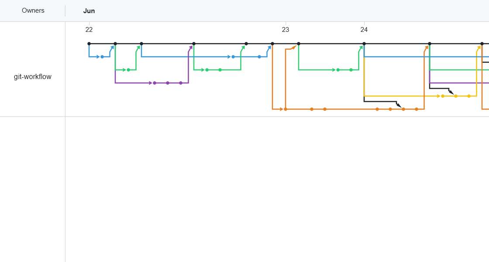

# Submission Index

## ## 변경 및 추가 사유
- 과제 최종 제출 및 평가를 위해 저장소의 모든 협업 활동(팀 정보, 멤버별 PR 링크, 핵심 문서 경로, 증징 데이터)을 일목요연하게 정리한 인덱스 문서 구축 필요.
- 평가자가 프로젝트의 전체 흐름(GitHub Flow 운영 및 비자명 충돌 해결 이력)을 한눈에 확인하고 신속하게 검증할 수 있도록 지원하기 위함.

---

## ## Team
- **저장소:** https://github.com/git-workflow/b2-2.git

---

## ## Member PRs
- **김한규**
  - PR: https://github.com/git-workflow/b2-2/pull/2 (chore: create issue template)
  - PR: https://github.com/git-workflow/b2-2/pull/5 (chore: create pr template)
  - PR: https://github.com/git-workflow/b2-2/pull/9 (docs: 과제 수행을 위한 사전 지식 학습 노트
  )
  - PR: https://github.com/git-workflow/b2-2/pull/22 (docs: git reset에 대한 트러블슈팅 시나리오 추가)
  - PR: https://github.com/git-workflow/b2-2/pull/25 (docs: git revert에 대한 트러블슈팅 시나리오 추가)
  - PR: https://github.com/git-workflow/b2-2/pull/30 (docs: conflict-resolution.md 충돌 기록2 작성)

- **권창범**
  - PR: https://github.com/git-workflow/b2-2/pull/10 (docs: add contributing guide)
  - PR: https://github.com/git-workflow/b2-2/pull/12 (docs: add git workflow notes)
  - PR: https://github.com/git-workflow/b2-2/pull/16 (docs: add amend troubleshooting scenario)
  - PR: https://github.com/git-workflow/b2-2/pull/28 (docs: add codeowners configuration)
  - PR:

- **서예영**
  - PR: https://github.com/git-workflow/b2-2/pull/8 (docs: b2-2 과제 용어 정리 학습 노트 문서 생성)
  - PR: https://github.com/git-workflow/b2-2/pull/20 (docs: stash troubleshooting 문서정리)
  - PR: https://github.com/git-workflow/b2-2/pull/24 (docs: conflict-resolution.md 충돌 기록1 작성)
  - PR: (docs: SUBMISSION.md 작성)

---

## ## Key Docs
- **Contributing:** `docs/CONTRIBUTING.md` (팀 브랜치 네이밍 컨벤션, 이슈-PR 연동 규칙, LGTM 금지 등의 코드 리뷰 품질 기준 수립)
- **Conflict log:** `docs/conflict-resolution.md` (`troubleshooting-log.md` 비자명 충돌 상황 및 해결 보고서)
- **Troubleshooting:** `docs/troubleshooting-log.md` (amend, reset, revert, stash 팀 전체 4종 시나리오 재현 절차, 해결 결과 및 실무 주의점 기록 완료)

---

## ## Evidence

