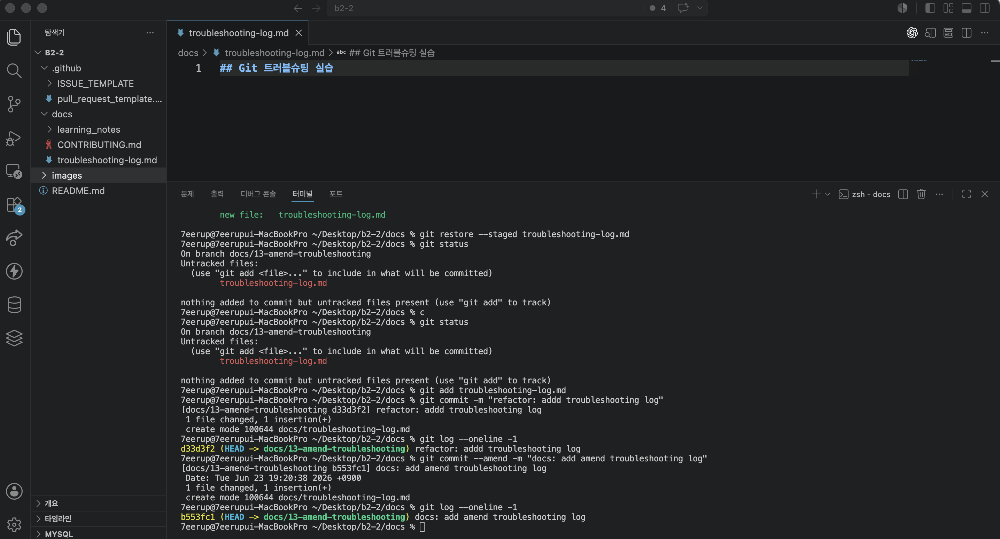

# Conflict Resolution Log

## 충돌 기록 #1

### 상황(What happened)
* 대상 브랜치/파일: docs/14-stash-troubleshooting 브랜치의 docs/troubleshooting-log.md 파일.

* 발생 상황: 팀원이 amend 트러블슈팅 내용을 해당 문서의 1번 줄부터 작성하여 이미 main 브랜치에 반영(Merge)을 완료한 상태였음. 본인 또한 이 사실을 모른 채 동일한 파일의 1번 줄부터 stash 트러블슈팅 내용을 작성함. 이후 최신 main 내용을 반영하기 위해 git pull을 실행하자, 동일한 위치(1번 줄)를 동시에 수정한 것에 대해 비자명 충돌 발생.

### 충돌 내용(Conflict markers)
```txt
<<<<<<< HEAD
# Troubleshooting Log

## 시나리오: `git stash`, `git stash pop`

### 상황
- branch가 main이 아닌 다른 branch에서 분기해서 생긴 문제

### 시도한 명령/절차
- `git status`: 현재 문제 상황 파악.

- `git reflog`: 이전 기록을 확인하여 브랜치 분기가 잘못 나누어져 있는 원인 확인.

- `git stash`: 작업 내용을 임시 저장하려 했으나, 새로 생성된 문서(Untracked)만 있어서 아무것도 저장되지 않음.

- `git stash -u`: 새로 생성한 문서 파일들까지 전부 포함하기 위해 -u 옵션을 사용하여 성공적으로 임시 보관.

- `git switch main`: 올바른 분기의 기준이 되는 메인 브랜치로 이동.

- `git switch [새 브랜치명]`: 메인에서 제대로 파생된 새로운 브랜치(docs/14-stash-troubleshooting)로 전환.

- `git stash pop`: 새 브랜치에서 임시 보관해 두었던 작업을 다시 꺼내어 적용 시도.


### 결과
- 에러 발생 및 원인: git stash pop 실행 시 error: could not restore untracked files from stash 에러 발생. 가져온 Untracked 파일과 대상 브랜치에 이미 존재하는 파일 이름이 겹쳐서 Git이 안전을 위해 덮어쓰기를 차단함.

- 해결 과정: 에러가 발생하여 stash 내역은 목록에서 삭제되지 않고 안전하게 보존됨(The stash entry is kept...). 충돌이 발생한 파일을 수동으로 정리한 뒤 다시 git add하여 문제 해결.

- 주의할 점: stash -u로 새로운 파일까지 한 번에 묶어서 옮길 때, 타겟 브랜치에 동일한 경로/이름의 파일이 있으면 충돌 에러가 발생할 수 있으므로 주의 요망.

### 왜 이 방법을 선택했는가(Why)
- 의미 없는 커밋 방지: 작업이 마무리되지 않은 상태에서 억지로 WIP(Work In Progress) 등 무의미한 커밋을 히스토리에 남기지 않기 위함.

- 작업물 유실 방지: 변경 사항을 그대로 둔 채 브랜치를 이동(switch)하면 파일 구조의 차이로 인해 작업물이 꼬이거나 날아갈 위험이 큼.

- 결론: 미완성 작업을 가장 안전하게 캡슐화하여 보관했다가 꺼낼 수 있는 stash 방식이 최적이라고 판단. 특히 새로 생성된 문서를 함께 옮기기 위해 -u 옵션 사용이 필수적이었음.
=======
## Git 트러블슈팅 실습

### 시나리오: git commit --amend

* `docs/troubleshooting-log.md` 파일을 생성한 후 커밋 메시지를 `refactor: addd troubleshooting log`로 잘못 작성하였다.
* 커밋 메시지 규칙에 맞게 수정할 필요가 있었다.

### 시도한 명령/절차

```bash
git status

git add docs/troubleshooting-log.md

git commit -m "refactor: addd troubleshooting log"

git commit --amend -m "docs: add amend troubleshooting log"

git log --oneline -1


### 결과

```bash
b553fc1 (HEAD -> docs/13-amend-troubleshooting) docs: add amend troubleshooting log


* 최근 커밋 메시지를 정상적으로 수정하였다.
* 새로운 커밋을 생성하지 않고 기존 커밋을 수정하였다.

### 왜 이 방법을 선택했는가

* 가장 최근 커밋의 메시지만 수정하면 되었기 때문이다.
* 불필요한 추가 커밋을 만들지 않고 수정할 수 있다.

### 배운 점

* 최근 커밋 메시지는 `git commit --amend`로 수정할 수 있다.
* 커밋을 원격 저장소에 push하기 전에 수정하는 것이 가장 안전하다.
* 커밋 전 `git status`로 변경 파일을 확인하는 습관이 중요하다.


### 실행 결과


>>>>>>> 05e1abde2109e4f5eed29c9ecbc201052e25b525

```

### 해결 과정(How)

* 선택한 해결 전략: Keep Both (두 내용 모두 유지하되 순서 조정)

* 이유: amend와 stash 모두 작성해야하므로 문서의 흐름상 main에 먼저 올라간 상대방의 문서를 상단에 배치하고, 본인의 문서를 그 아래에 이어 붙이는 형식을 취함.

* 실제 수행 명령 또는 절차:
```
1. 에디터(VS Code)의 3-way Merge Editor(3분할 창 툴)를 활성화하여 내 파일(Current), 메인의 파일(Incoming), 최종 결과물 창을 한 화면에 띄움.

2. 3분할 화면을 보면서 메인 브랜치의 문서 내용을 먼저 최종 창에 수용(Accept Incoming)함.

3. 이어서 본인 브랜치의 문서 내용을 그 바로 아랫줄에 붙여넣어 하나의 완성된 파일 구조로 편집함.

4. 충돌 마커가 자동으로 깔끔하게 정리된 것을 확인 후 파일 저장.

5. 터미널에서 git add .를 수행하여 충돌 해결 상태를 스테이징 영역에 반영함.
```

### 결과(Outcome)
* main 브랜치에 있던 상대방의 amend 시나리오가 상단에 먼저 위치하고, 본인의 stash 시나리오가 하단에 자연스럽게 이어지는 하나의 통합 트러블슈팅 로그 문서 완성.

* 터미널의 |MERGING 상태가 해제되고 working tree clean 상태가 되었으며, 원격 저장소(docs/14-stash-troubleshooting)로 정상 Push 완료.

### 배운 점(Learnings)
* 도구 활용의 중요성: 복잡하게 꼬인 충돌 마커도 에디터의 3분할 창(3-way Merge) 도구를 활용하면 시각적으로 안전하고 직관적으로 해결할 수 있음을 배움.

* 향후 예방 대책: 공통 문서 작업을 진행할 때는 파일의 시작 지점(1번 줄)부터 무작정 쓰기보다, 팀원 간 사전에 영역을 분할하거나 목차를 먼저 고정해 두어 동일한 라인이 겹쳐 발생하는 비자명 충돌을 최소화하고자 함.