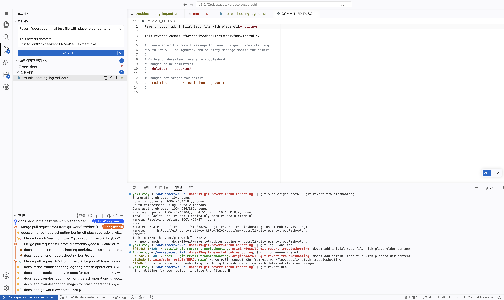

# Git 트러블슈팅 실습

## 시나리오: `git commit --amend`

* `docs/troubleshooting-log.md` 파일을 생성한 후 커밋 메시지를 `refactor: addd troubleshooting log`로 잘못 작성하였다.
* 커밋 메시지 규칙에 맞게 수정할 필요가 있었다.

### 시도한 명령/절차

```bash
git status

git add docs/troubleshooting-log.md

git commit -m "refactor: addd troubleshooting log"

git commit --amend -m "docs: add amend troubleshooting log"

git log --oneline -1
```

### 결과

```bash
b553fc1 (HEAD -> docs/13-amend-troubleshooting) docs: add amend troubleshooting log
```

* 최근 커밋 메시지를 정상적으로 수정하였다.
* 새로운 커밋을 생성하지 않고 기존 커밋을 수정하였다.

### 왜 이 방법을 선택했는가

* 가장 최근 커밋의 메시지만 수정하면 되었기 때문이다.
* 불필요한 추가 커밋을 만들지 않고 수정할 수 있다.

### 배운 점

* 최근 커밋 메시지는 `git commit --amend`로 수정할 수 있다.
* 커밋을 원격 저장소에 push하기 전에 수정하는 것이 가장 안전하다.
* 커밋 전 `git status`로 변경 파일을 확인하는 습관이 중요하다.


### 실행 결과


## 시나리오: `git revert`
### 왜 이 방법을 선택했는가
* 이미 원격에 push한 경우에는 `reset`을 하면 로컬과 원격 레포의 상태가 달라지는 문제가 생깁니다.
* 그래서 이런 상황에는 `revert`를 사용하는게 알맞습니다.


### 배운점
#### `git revert` — 원격에 push된 커밋 되돌리기 (히스토리 보존)
**상황:** 이미 원격에 push한 커밋을 되돌리되, 커밋 히스토리는 보존하고 싶을 때

```bash
# 특정 커밋을 되돌리는 새로운 커밋 생성
git revert <커밋해시>

# 예시
git revert a1b2c3d
# → 에디터가 열리면 revert 커밋 메시지 확인 후 저장

git push origin main
```

**revert vs reset 핵심 차이:**

```text
[reset]  A ── B ── C  →  A ── B     (C를 삭제 — 히스토리 변조)
[revert] A ── B ── C  →  A ── B ── C ── C'  (C를 되돌리는 새 커밋 C' 추가 — 히스토리 보존)
```

| 항목 | `reset` | `revert` |
|---|---|---|
| **히스토리** | 삭제 (변조됨) | 보존 (새 커밋 추가) |
| **push 후 사용** | ❌ 위험 (금지) | ✅ 안전 |
| **팀 협업** | 다른 팀원에게 영향 줌 | 영향 없음 |
| **사용 시점** | 로컬에서만 | 언제든지 가능 |

#### 중간 커밋을 revert할 때 주의사항

**특정 상황:** 최신 커밋이 아닌 중간 커밋(예: B)을 revert해야 할 때

```text
초기 상태:
A ── B ── C

git revert B 실행 후:
A ── B ── C ── B'
     ↑        ↑
  (원본)   (B의 변경사항 반대로 적용)
```

**구체적인 예시:**
```text
파일 변경 흐름:
A:     file.txt = "hello"
B:     file.txt = "hello world"  (B가 "world" 추가)
C:     file.txt = "hello world!!" (C가 "!!" 추가)

git revert B 후:
B':    file.txt = "hello"  (B의 변경사항 제거)
```

**⚠️ 잠재적 문제: Conflict 발생 가능**

| 경우 | 결과 |
|---|---|
| B와 C가 다른 부분 수정 | 충돌 없음 ✓ |
| B와 C가 **같은 부분** 수정 | **CONFLICT 발생** ⚠️ |

**예시 (충돌 발생):**
```
B가 line 3 수정: "A" → "B"
C가 같은 line 3 수정: "B" → "C"
git revert B하면: "C" → "A"로 변경하려 함
→ 충돌 발생!
```

**결론:** 중간 커밋 revert도 가능하지만, 최신 커밋을 revert하는 것이 **가장 안전하고 충돌 위험이 적습니다.** 💡

### 시도한 명령/절차
#### git commit, push 까지 한 상황
```
@hkk-cody ➜ /workspaces/b2-2 (docs/19-git-revert-troubleshooting) $ git push origin docs/19-git-revert-troubleshooting 
Enumerating objects: 104, done.
Counting objects: 100% (104/104), done.
Delta compression using up to 2 threads
Compressing objects: 100% (86/86), done.
Writing objects: 100% (104/104), 534.51 KiB | 10.48 MiB/s, done.
Total 104 (delta 27), reused 3 (delta 0), pack-reused 0 (from 0)
remote: Resolving deltas: 100% (27/27), done.
remote: 
remote: Create a pull request for 'docs/19-git-revert-troubleshooting' on GitHub by visiting:
remote:      https://github.com/git-workflow/b2-2/pull/new/docs/19-git-revert-troubleshooting
remote: 
To https://github.com/git-workflow/b2-2
 * [new branch]      docs/19-git-revert-troubleshooting -> docs/19-git-revert-troubleshooting
@hkk-cody ➜ /workspaces/b2-2 (docs/19-git-revert-troubleshooting) $ git log --oneline -1
3f6c4c5 (HEAD -> docs/19-git-revert-troubleshooting, origin/docs/19-git-revert-troubleshooting) docs: add initial test file with placeholder content
```
#### 잘못된 commit을 취소하기 위해 revert


#### revert 후 git log 
```
@hkk-cody ➜ /workspaces/b2-2 (docs/19-git-revert-troubleshooting) $ git log --oneline -2
34c571b (HEAD -> docs/19-git-revert-troubleshooting) Revert "docs: add initial test file with placeholder content"
3f6c4c5 (origin/docs/19-git-revert-troubleshooting) docs: add initial test file with placeholder content
```

### 결과
* push한 commit을 다른 내용으로 바꾸고 싶을 때 `git revert`를 사용하면 히스토리도 유지가 되면서 내용을 바꿀 수 있습니다.
* 하지만 마지막 commit이 아닌 중간 commit을 바꾸면 충돌이 날 수 있기 때문에 주의해야 합니다.


## 시나리오: `git stash`, `git stash pop`

* branch가 main이 아닌 다른 branch에서 분기해서 문제가 생겼다.

### 시도한 명령/절차

* `git status`: 현재 문제 상황을 파악하였다.


* `git reflog`: 이전 기록을 확인하여 브랜치 분기가 잘못 나누어져 있는 원인 확인하였다.


* `git stash`: 작업 내용을 임시 저장하려 했으나, 새로 생성된 문서(Untracked)만 있어서 아무것도 저장되지 않았다.


* `git stash -u`: 새로 생성한 문서 파일들까지 전부 포함하기 위해 -u 옵션을 사용하여 성공적으로 임시 보관하였다.


* `git switch main`: 올바른 분기의 기준이 되는 메인 브랜치로 이동하였다.


* `git switch branch`: 메인에서 제대로 파생된 새로운 브랜치(docs/14-stash-troubleshooting)로 전환하였다.


* `git stash pop`: 새 브랜치에서 임시 보관해 두었던 작업을 다시 꺼내어 적용 시도하였다.


### 결과

* 에러 발생 및 원인: main이 아닌 다른 branch에서 분기를 함으로 인해 github flow에 맞지 않는 상황이 발생하였다.

* 해결 과정: 작업 중이던 내용을 `git stash`로 임시 저장을 하여 main브랜치에서 분기한 github flow에 알맞는 브랜치로 이동하였다.


### 왜 이 방법을 선택했는가
* 의미 없는 커밋 방지: 작업이 마무리되지 않은 상태에서 억지로 WIP(Work In Progress) 등 무의미한 커밋을 히스토리에 남기지 않기 위함.

* 작업물 유실 방지: 변경 사항을 그대로 둔 채 브랜치를 이동(switch)하면 파일 구조의 차이로 인해 작업물이 꼬이거나 날아갈 위험이 큼.

* 결론: 미완성 작업을 가장 안전하게 캡슐화하여 보관했다가 꺼낼 수 있는 stash 방식이 최적이라고 판단. 특히 새로 생성된 문서를 함께 옮기기 위해 -u 옵션 사용이 필수적이었음.


