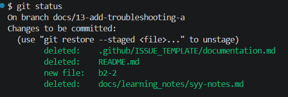
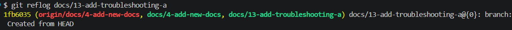
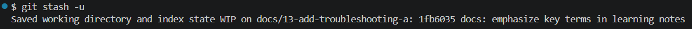
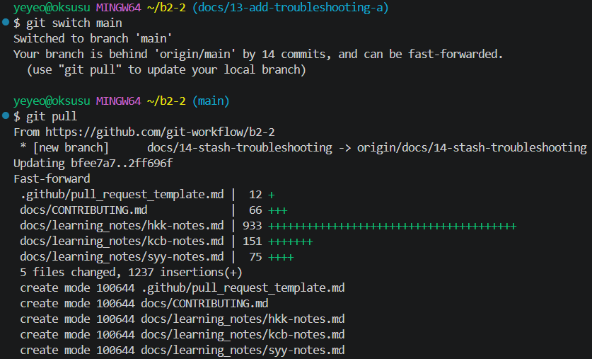
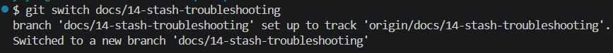
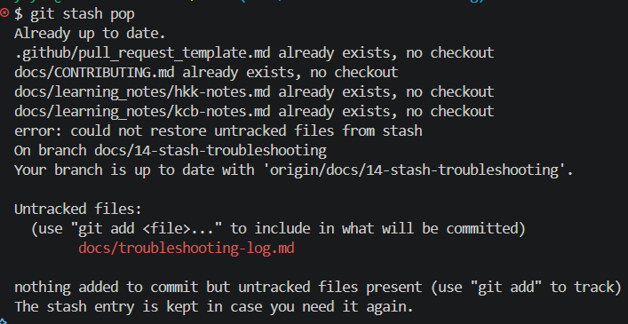

# Git 트러블슈팅 실습

## 시나리오: `git commit --amend`

* `docs/troubleshooting-log.md` 파일을 생성한 후 커밋 메시지를 `refactor: addd troubleshooting log`로 잘못 작성하였다.
* 커밋 메시지 규칙에 맞게 수정할 필요가 있었다.

### 시도한 명령/절차

```bash
git status

git add docs/troubleshooting-log.md

git commit -m "refactor: addd troubleshooting log"

git commit --amend -m "docs: add amend troubleshooting log"

git log --oneline -1
```

### 결과

```bash
b553fc1 (HEAD -> docs/13-amend-troubleshooting) docs: add amend troubleshooting log
```

* 최근 커밋 메시지를 정상적으로 수정하였다.
* 새로운 커밋을 생성하지 않고 기존 커밋을 수정하였다.

### 왜 이 방법을 선택했는가

* 가장 최근 커밋의 메시지만 수정하면 되었기 때문이다.
* 불필요한 추가 커밋을 만들지 않고 수정할 수 있다.

### 배운 점

* 최근 커밋 메시지는 `git commit --amend`로 수정할 수 있다.
* 커밋을 원격 저장소에 push하기 전에 수정하는 것이 가장 안전하다.
* 커밋 전 `git status`로 변경 파일을 확인하는 습관이 중요하다.


### 실행 결과


## 시나리오: `git stash`, `git stash pop`

* branch가 main이 아닌 다른 branch에서 분기해서 문제가 생겼다.

### 시도한 명령/절차

* `git status`: 현재 문제 상황을 파악하였다.




* `git reflog`: 이전 기록을 확인하여 브랜치 분기가 잘못 나누어져 있는 원인 확인하였다.




* `git stash`: 작업 내용을 임시 저장하려 했으나, 새로 생성된 문서(Untracked)만 있어서 아무것도 저장되지 않았다.


* `git stash -u`: 새로 생성한 문서 파일들까지 전부 포함하기 위해 -u 옵션을 사용하여 성공적으로 임시 보관하였다.




* `git switch main`: 올바른 분기의 기준이 되는 메인 브랜치로 이동하였다.




* `git switch branch`: 메인에서 제대로 파생된 새로운 브랜치(docs/14-stash-troubleshooting)로 전환하였다.




* `git stash pop`: 새 브랜치에서 임시 보관해 두었던 작업을 다시 꺼내어 적용 시도하였다.




### 결과

* 에러 발생 및 원인: main이 아닌 다른 branch에서 분기를 함으로 인해 github flow에 맞지 않는 상황이 발생하였다.

* 해결 과정: 작업 중이던 내용을 `git stash`로 임시 저장을 하여 main브랜치에서 분기한 github flow에 알맞는 브랜치로 이동하였다.


### 왜 이 방법을 선택했는가
* 의미 없는 커밋 방지: 작업이 마무리되지 않은 상태에서 억지로 WIP(Work In Progress) 등 무의미한 커밋을 히스토리에 남기지 않기 위함.

* 작업물 유실 방지: 변경 사항을 그대로 둔 채 브랜치를 이동(switch)하면 파일 구조의 차이로 인해 작업물이 꼬이거나 날아갈 위험이 큼.

* 결론: 미완성 작업을 가장 안전하게 캡슐화하여 보관했다가 꺼낼 수 있는 stash 방식이 최적이라고 판단. 특히 새로 생성된 문서를 함께 옮기기 위해 -u 옵션 사용이 필수적이었음.


## 시나리오: `git reset --soft HEAD~1`


## 시나리오: `git revert`


